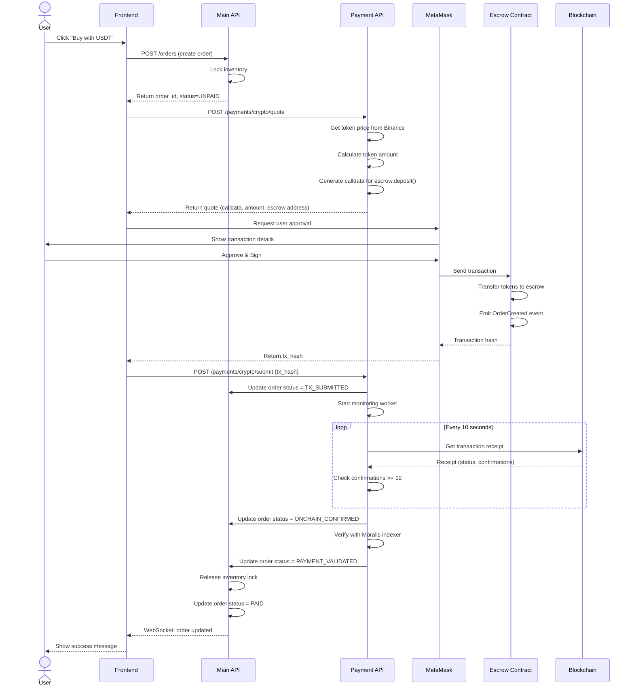
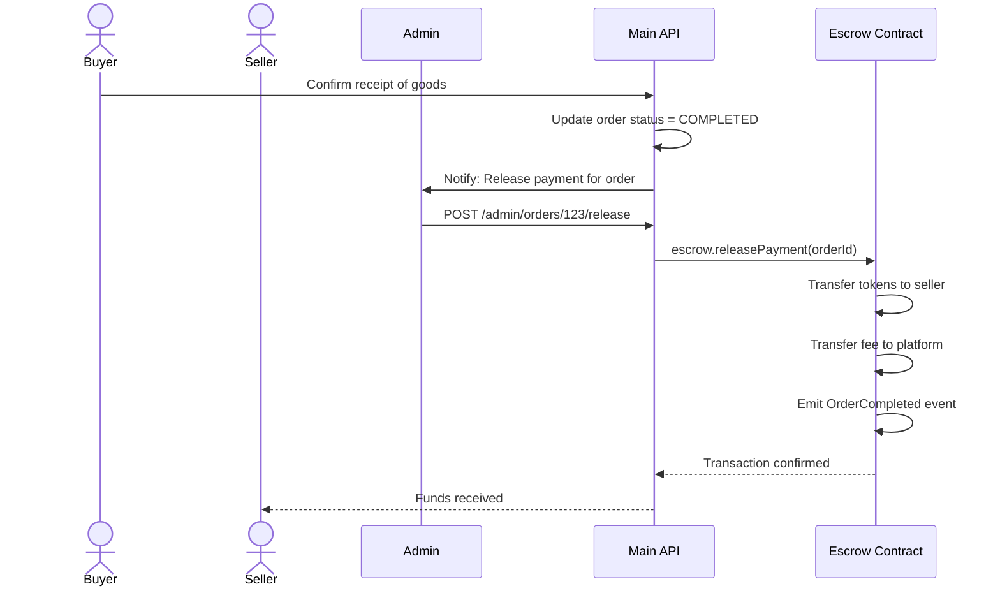
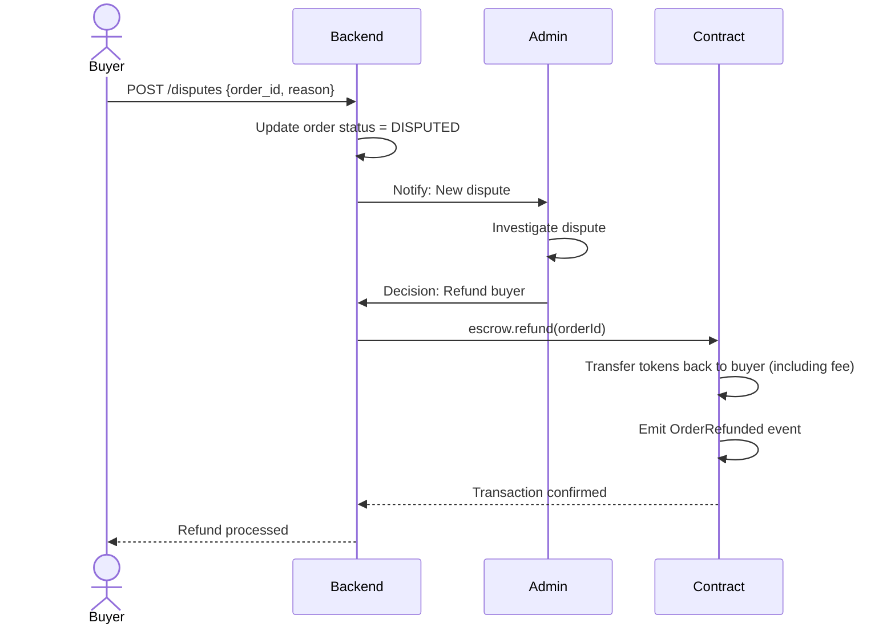

# Web3 Payment Flows

This document explains the cryptocurrency payment flows in the marketplace.

## Overview

The platform implements a **non-custodial** payment system where:
- Users maintain full control of their funds
- Payments are held in smart contract escrow
- Platform cannot access user funds directly
- On-chain settlement provides trustless transactions

---

## Flow 1: Crypto Payment (Happy Path)



### Step-by-Step Breakdown

#### 1. Order Creation
```typescript
// Frontend
const response = await apiClient.post('/orders', {
  product_id: 123,
  quantity: 1,
  payment_method: 'crypto'
});
// Order status: UNPAID
// Inventory: LOCKED (10 min TTL)
```

#### 2. Get Payment Quote
```typescript
// Frontend
const quote = await paymentClient.post('/payments/crypto/quote', {
  order_id: response.data.order_id,
  token_symbol: 'USDT'
});

// Response:
{
  escrow_contract: '0x...',
  token_address: '0x...',
  amount_wei: '999500000', // 999.5 USDT (6 decimals)
  calldata: '0x...',
  expires_at: timestamp + 600 // 10 minutes
}
```

#### 3. User Signs Transaction
```typescript
// Frontend - ethers.js
const tx = {
  to: quote.escrow_contract,
  data: quote.calldata,
  value: 0 // For ERC20, value is 0
};

const signer = await provider.getSigner();
const txResponse = await signer.sendTransaction(tx);
const txHash = txResponse.hash;
```

#### 4. Submit Transaction Hash
```typescript
// Frontend
await paymentClient.post('/payments/crypto/submit', {
  order_id: orderId,
  tx_hash: txHash
});
// Order status: TX_SUBMITTED
```

#### 5. Backend Monitoring
```typescript
// Payment Service Worker
async function monitorTransaction(txHash) {
  const receipt = await provider.getTransactionReceipt(txHash);
  
  if (!receipt) {
    // Transaction still pending
    return 'ONCHAIN_PENDING';
  }
  
  if (receipt.status === 0) {
    // Transaction failed
    return 'TX_FAILED';
  }
  
  if (receipt.confirmations < 12) {
    // Wait for more confirmations
    return 'ONCHAIN_PENDING';
  }
  
  // Transaction confirmed
  return 'ONCHAIN_CONFIRMED';
}
```

#### 6. Indexer Verification
```typescript
// Payment Service
async function verifyWithIndexer(txHash) {
  // Query Moralis or The Graph
  const moralisData = await moralis.getTransaction(txHash);
  
  // Verify event logs
  const depositEvent = moralisData.logs.find(
    log => log.topics[0] === keccak256('OrderCreated(string,address,address,uint256)')
  );
  
  if (depositEvent) {
    // Extract order ID from event
    const orderId = decodeOrderId(depositEvent.data);
    return { verified: true, orderId };
  }
  
  return { verified: false };
}
```

---

## Flow 2: Payment Failure Scenarios

### Scenario A: User Rejects Transaction
```
1. User clicks "Buy with USDT"
2. Order created, inventory locked
3. MetaMask popup appears
4. User clicks "Reject"
5. Frontend: No tx_hash available
6. After 10 minutes: Inventory lock expires
7. Order remains UNPAID, can be cancelled
```

### Scenario B: Transaction Fails On-Chain
```
1. User signs transaction
2. Transaction submitted to blockchain
3. Transaction fails (insufficient gas, reverted)
4. Backend detects receipt.status = 0
5. Order status: TX_FAILED
6. Inventory lock released
7. User notified, can retry
```

### Scenario C: Insufficient Token Balance
```
1. User signs transaction
2. Blockchain rejects: "ERC20: transfer amount exceeds balance"
3. No transaction hash generated
4. MetaMask shows error
5. User must add funds and retry
```

---

## Flow 3: Escrow Release (Order Completion)



### Admin Release Function
```typescript
// Smart Contract
function releasePayment(string memory orderId) external onlyRole(ADMIN_ROLE) {
    Order storage order = orders[orderId];
    require(order.status == OrderStatus.Paid, "Invalid status");
    
    // Transfer to seller
    IERC20(order.token).transfer(order.seller, order.amount);
    
    // Transfer fee to platform
    IERC20(order.token).transfer(feeVault, order.fee);
    
    order.status = OrderStatus.Completed;
    emit OrderCompleted(orderId);
}
```

---

## Flow 4: Dispute & Refund



---

## Security Considerations

### 1. Replay Attack Prevention
- Each order has a unique `internal_order_id` (UUID)
- Smart contract checks: `require(orders[orderId].buyer == address(0), "Order exists")`
- Cannot deposit twice for same order

### 2. Front-Running Protection
- Price quotes expire after 10 minutes
- Backend validates: `current_price <= quote_price * (1 + max_slippage)`
- If price moved unfavorably, reject transaction

### 3. Double-Spend Prevention
- Inventory locked atomically with order creation
- Optimistic locking with version column
- If two users try to buy last item, one fails

### 4. MEV Mitigation
- No sensitive operations in smart contract
- Escrow simply holds funds, no price oracles
- Settlement happens off-chain (admin-triggered)

---

## Monitoring & Alerts

### Critical Metrics
- Transaction success rate: > 95%
- Average confirmation time: < 5 minutes
- Indexer sync lag: < 30 seconds
- Failed transaction rate: < 5%

### Alerts
- **HIGH**: Transaction stuck pending > 30 minutes
- **MEDIUM**: Indexer offline > 5 minutes
- **LOW**: Gas price spike > 100 gwei

---

## Testing Scenarios

### Happy Path
1. Buy product with USDT
2. Transaction confirms in 12 blocks
3. Order status reaches PAID
4. Admin releases payment
5. Seller receives funds

### Edge Cases
1. User cancels before signing → No charge
2. Transaction pending > 10 min → Order expires
3. Insufficient balance → Transaction rejected
4. Network congestion → Delayed confirmation
5. Buyer disputes → Refund processed

---

## Useful Commands

### Check Transaction Status
```bash
cast tx 0x... --rpc-url https://polygon-rpc.com
```

### Verify Contract Events
```bash
cast logs --address 0x... --from-block 12345 --rpc-url ...
```

### Query Order Status
```bash
curl -X GET http://localhost:3001/api/orders/123 \
  -H "Authorization: Bearer <token>"
```
